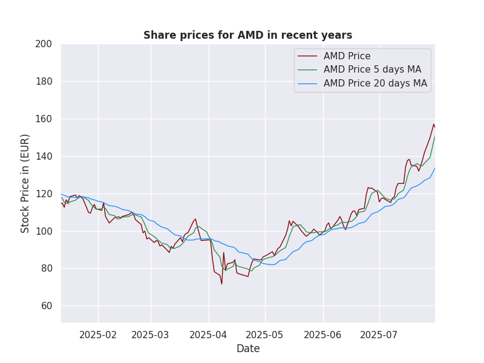

# StkView

## Foundational Data Analysis for Stocks

**StkView**

## Table of Contents

* Description
* Volatility and Value of Risk
* Moving Averages
* Relative Strength Index and Sharpe Ratio
* Monte-Carlo Simulation
* Long Short-Term Memory Model
* Installation
* File Structure
* License

## Description

* The Python script loads a CSV file from the **data** directory that contains five‑year stock price histories for a random selection of globally active companies. The data is imported into a Pandas DataFrame, where the date column is parsed into a proper "datetime" format. Because the dataset uses commas as thousands separators, we replace them with periods and cast the numeric columns to "float". A custom function corrects obvious typos that inflate values into the hundreds of thousands.
* We perform data quality checks: ensuring no missing values in the key columns and that each row has sufficient length to compute a moving‑average plot. Columns with incomplete data are dropped. Basic descriptive statistics (mean, standard deviation, min, max) are calculated for the entire dataset and printed to the console.
* Next, we construct a diversified portfolio by selecting five technology firms and assigning them different weights. We compute portfolio volatility, daily returns, and the Value‑at‑Risk (VaR). These metrics are visualized in a heatmap.
* For a deeper analysis of a single stock Advanced Micro Devices (AMD) we calculate and plot its moving average, **Relative Strength Index** (RSI) to identify overbought / oversold conditions, and **Sharpe Ratio**.
* A Monte‑Carlo simulation runs over 250 days projects AMD’s future price distribution, with the color intensity indicating the most probable outcomes.
* Finally, we train an **LSTM** model (using PyTorch) to forecast short‑term price movements based on the previous four days. The dataset is split to 80 % / 20 % for training / testing purpose; the model successfully captures the trend very well.

## Volatility and Value of Risk

Historical volatility is the standard deviation of the past returns, usually daily or weekly rolled up to an annual figure. Volatility is a **statitical** measure of how much a stock's price tends to swing. It is expressed as a percentage and is usually annualized for comparability.
A practical way to translate volatility into a **Value of Risk** is to compute it for the portfolio. These give you a dollar amount that represents the worst expected loss over a give horizon at a chose confidence level.


## Moving Averages



## Relative Strength Index and Sharpe Ratio

The **Relative Strength Index** (RSI) is a momentum oscillator used in technical analysis to gauge speed and change of price movements. Its primary purpose is to help traders spot potential trend reversals, overbought or oversold conditions, and confirm other trading signals.


The Sharpe Ration is a quick, widely-used metric that tells you how much excess return you're getting for each unit of risk you are taking on. In other words, it measures **risk-adjusted performance**. Why it matters: Two funds might have the same average return, but if one is much more volatile, the Sharpe Ratio will show that the risk-adjusted return is lower.


## Monte-Carlo Simulation


## Long Short-Term Memory Model


## Installation

### Prerequisites

* python 3.12.11
* pip (Python package manager)
 
### Clone the repo:
```
git clone https://github.com/mschindler779/StkView.git
cd FluxCat
```

### Create a virtual environment (optional but recommended)
```
python -m venv /path/to/new/virtual/environment
source /path/to/new/virtual/environment/bin/activate
```

### Install dependencies
```
python -m pip install -r requirements.txt
```

### Usage
```
python StkView.py
```    

## File Structure

├── StkView.py **Main Python application**<br/>
├── AMD-MA.png **Graphic for Moving Averages**<br/>
├── AMD-RSI.png **Graphic for Relative Strength-Index**<br/>
├── Heatmap.png **Graphic for Heatmap**<br/>
├── LSTM.png **Graphic for the LSTM-Model**<br/>
├── Monte Carlo.png **Graphic for Monte-Carlo**<br/>
├── Sharpe Ratios.png **Graphic for Sharpe Ratios**<br/>
├── requirements.txt	**Python dependencies**<br/>
├── README.md **This file**<br/>
└── LICENSE **Unlicense**

## License

This project is licensed under the Unlicense - see the LICENSE file for details

© 2025 Markus Schindler
